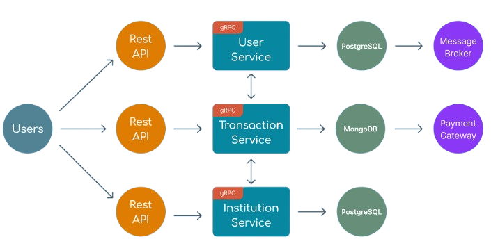
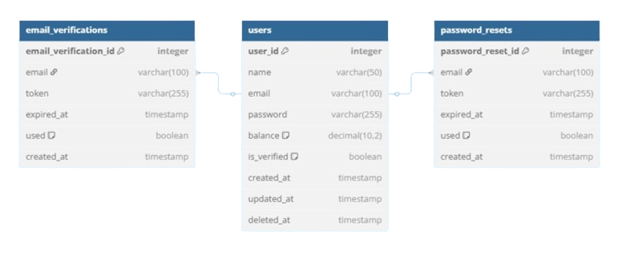

# edu-connect
EduConnect adalah platform yang menghubungkan institusi pendidikan formal maupun non formal dengan calon donatur melalui kampanye penggalangan dana yang transparan dan terfokus. Platform ini dirancang untuk membantu institusi mengumpulkan dana pendidikan, yang nantinya dapat digunakan untuk memberikan beasiswa kepada siswa yang membutuhkan.

Melalui EduConnect, setiap institusi dapat:

Membuat kampanye penggalangan dana yang mencakup tujuan, target dana, dan detail penggunaan dana.

Mengelola donasi yang masuk secara real-time.

Menyalurkan dana tersebut kepada penerima manfaat secara tepat sasaran.

Platform ini terinspirasi dari konsep seperti Kitabisa.com, namun secara khusus difokuskan untuk mendukung dunia pendidikan di Indonesia. EduConnect dikembangkan dalam waktu 5 hari sebagai proyek akhir Bootcamp Hacktiv8 Golang, mulai dari perencanaan ide hingga presentasi akhir.

## Arsitektur Sistem EduConnect

## ERD User Service EduConnect

## ERD Institution Service EduConnect

## ERD Transaction Service EduConnect

